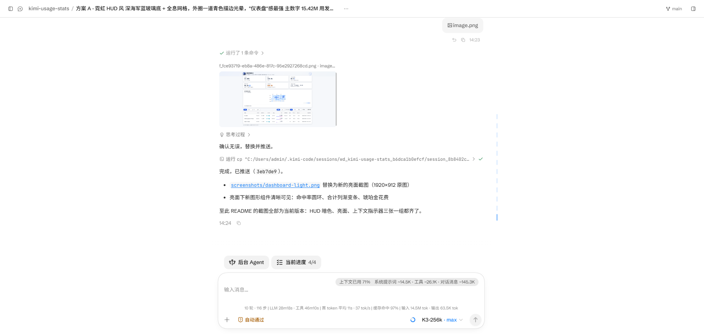
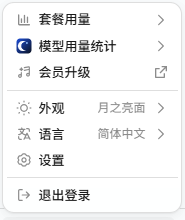
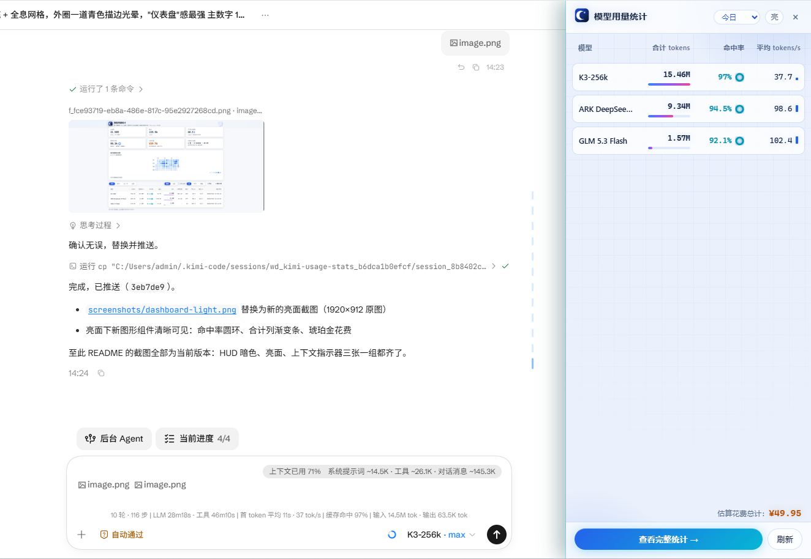

<div align="center">

# Kimi代码模型用量统计（社区版）

**Kimi Code 每个模型的 token 消耗、缓存命中率、生成速度与花费估算 —— 100% 本地统计**

> **社区版声明（Community Edition）**
> 本项目是一个**非官方社区项目**，由开发者独立开发与维护，**与月之暗面（Moonshot AI）没有任何关联**。
> 项目名为「Kimi 模型用量统计 · 社区版」，logo 为开发者自绘设计，不代表官方产品。
> 如官方对命名或图形有异议，欢迎联系作者调整。


</div>

---

## 这是什么？

`kimi-usage-stats` 是一个 Chrome 浏览器扩展（Manifest V3），专门统计 [Kimi Code](https://kimi.com) 中**每个模型的 token 消耗量**。

- **总消耗 / 输出 / 缓存命中 / 命中率** —— 一眼看清每个模型用得多不多、性价比高不高
- **生成速度（tokens/s）** —— 平均与最近速度，判断模型快慢
- **估算花费（¥）** —— 按内置官方价目表折算大概花了多少钱
- **峰谷计价** —— 支持按时段分别定价（如 DeepSeek 高峰/闲时），峰、谷分别计费后自动汇总总成本，并显示「峰 ¥x · 谷 ¥y」拆分
- **365 天每日消耗热力图** —— 点击任意日期下钻查看当日明细
- **会话级下钻** —— 按项目/会话统计，含被打断轮次的浪费消耗

数据**全部来自本地 `~/.kimi-code`**，扩展不发起任何网络请求，统计结果永不上传。

## 截图

| 🌌 霓虹 HUD（暗色） | 🌕 月之亮面 |
| --- | --- |
|  |  |

### 上下文指示器（kimi web 输入框上方）

指示器常驻 kimi web 对话页输入框上方，随会话实时刷新：




**上行 · 上下文占用**：实时显示当前会话上下文窗口的占用与组成——


| 字段 | 含义 |
| --- | --- |
| `上下文已用 62%` | 当前会话上下文 ÷ 模型上下文上限（悬停可见具体 token 数，如 `~160.2K / 256.0K`） |
| `系统提示词 ~14.5K` | 系统提示词占用的 token |
| `工具 ~26.1K` | 工具定义与工具结果占用的 token |
| `对话消息 ~121.2K` | 对话消息（含历史）占用的 token |

**下行 · 会话性能统计**——


| 字段 | 含义 |
| --- | --- |
| `6 轮 · 91 步` | 会话轮数（turn.prompt 次数）· LLM 调用步数 |
| `LLM 23m55s · 工具 45m50s` | LLM 累计耗时 · 工具执行累计耗时 |
| `首 token 平均 11s · 38 tok/s` | 首 token 平均延迟（TTFT）· 平均生成速度（输出 ÷ LLM 时长） |
| `缓存命中 97%` | 缓存读 ÷（缓存读 + 普通输入），越高越省 |
| `输入 10.1M tok · 输出 54.9K tok` | 会话累计输入（含缓存读）/ 输出 token |

指示器每 3 秒自动刷新，数据来自本地 `~/.kimi-code` 会话记录；未授权目录时显示「上下文：未授权」。

## 功能特性

- **按模型汇总**：未命中输入 / 缓存命中 / 缓存写、命中率（**发光圆环**）、输出、合计 tokens（**霓虹渐变条**）、请求数、平均与最近 tokens/s（**迷你柱状图**）、最近使用时间
- **按会话下钻**：项目（工作区）、会话、起止时间、时长、模型分布、估算花费、**中断轮次消耗**（被打断轮次浪费的 token 与金额）
- **365 天消耗热力图**：GitHub 风格日历，点击日期 → 当日详情面板 + 表格与汇总卡切换为该天数据
- **上下文指示器（kimi web 输入框上方）**：实时显示上下文占用百分比与组成分解（系统提示词 / 工具 / 对话消息的 token 数）；下方统计条展示 轮数·步数、LLM 与工具耗时、首 token 平均延迟、生成速度（tok/s）、缓存命中率、输入/输出 token —— 一眼看清当前会话的上下文压力和性能
- **时间筛选**：今日 / 昨天 / 近 7 天 / 全部（按本地 0 点切日）
- **三态主题**：🌕 月之亮面 / 🌌 霓虹 HUD（深海军蓝玻璃 + 全息网格 + 青色光晕，琥珀金高亮花费）/ 🖥 跟随系统（实时切换，三端共享）
- **增量扫描**：文件未变化（mtime + size）即跳过，只解析新增内容；IndexedDB 缓存，重复扫描只追加
- **价目表**：内置 Kimi / DeepSeek 官方参考价，可逐模型修改单价（输入 / 缓存命中 / 输出三档），并可为任意模型添加峰谷时段；保存后立即生效
  - 模型名与主表一致（取 `config.toml` 的 `display_name`），下方小字标出**取价键**（去 provider 前缀的短名，如 `kimi-for-coding`）——定价与行去重都按短名走，所以同短名的多个渠道会**共用一行价格**（会在小字里提示）

## 峰谷计价

部分服务商按「时段」定价（高峰贵、闲时便宜）。本扩展对每个模型支持两种计价方式，可混用：

| 方式 | 说明 | 数据形态 |
| --- | --- | --- |
| **单一计价** | 全天同价（原有行为，完全兼容） | `{ input, cacheRead, output }` |
| **峰谷** | 按记录发生时间落到不同时段，各段用各自单价，最后汇总总成本 | 额外带 `periods: [{ 类型, 起, 止, 适用日, 三档价 }]` |

规则：

- **基础价 = 高峰价**：价目表里「输入 / 缓存命中 / 输出」三档填高峰价；时段里通常只声明低谷（闲时）窗口，未落入任何时段的时间按基础价计。
- 时段区间为**左闭右开** `[起, 止)`；「起」晚于「止」表示**跨天**（例如 `22:00 → 06:00`，次日凌晨仍归属「声明该时段的那一天」）。
- 每个时段可勾选**适用日**（默认每天），因此「工作日高峰、周末全天闲时」这类规则也能表达。
- 同一时刻命中多个时段时**先声明者优先**。
- 保存时若某模型的时段为空，则记为显式停用峰谷（不会被内置默认时段覆盖）。
- 时段编辑区底部两个辅助按钮：
  - **套用内置时段** —— 把**内置价目表给该模型预置的时段**填进当前列表（例如 DeepSeek 的三段闲时窗口），**只覆盖时段、不动上方三档基础价**；已有内容时会先弹确认。该模型在内置表里没有预置时段时（如 Kimi 系列）按钮置灰，避免"点了只是把时段清空"。
  - **恢复内置默认价** —— 把列表内**有内置参考价**的模型恢复为内置价（含峰谷时段），自建 / 未收录的模型保持不动；同样要点「保存」才写入。

**内置默认（DeepSeek）**：自 2026-08-17 00:00（北京时间）起，DeepSeek 改用峰谷定价 —— 高峰为每日 `09:00-12:00` 与 `14:00-18:00`，其余时段为闲时且单价为高峰的一半。故内置：

| 模型 | 高峰（输入 / 缓存命中 / 输出） | 闲时（输入 / 缓存命中 / 输出） |
| --- | --- | --- |
| `deepseek-v4-flash` | 3 / 0.1 / 9 | 1.5 / 0.05 / 4.5 |
| `deepseek-v4-pro` | 9 / 0.3 / 27 | 4.5 / 0.15 / 13.5 |

> 单价单位：元 / 百万 tokens。DeepSeek 官方未明确区分工作日与周末，这里按「每天」处理；如你的实际计费把周末全天算作闲时，可在「价目表 → 峰谷…」里把三个闲时时段改为「周一～周五」。
>
> 其他模型默认仍是单一价，需要峰谷的话在「价目表」里点该模型的「峰谷…」添加时段即可。

**升级说明**：首次打开新版会做一次价目表迁移 —— 你**从未改动过**的行升级为内置新价（DeepSeek 行会拿到峰谷时段），**手动改过**的行原样保留。
注意 DeepSeek 官方自 2026-08-17 起既是调价也是改峰谷制：缓存命中输入 0.2 → 0.1（高峰价），未命中输入 1 → 3，输出 2 → 9。因此**缓存占比高时总额下降、输出占比高时上升**，属正常口径变化。

## 安装（开发模式）

1. 打开 Chrome（或夸克等 Chromium 内核浏览器），访问 `chrome://extensions`
2. 打开右上角「开发者模式」
3. 点击左上角「加载已解压的扩展程序」
4. 选择本项目目录（本仓库根目录）
5. 工具栏出现月牙图标即安装成功

> 提示：扩展推荐的入口页是 dashboard，首次使用点工具栏图标 → 「打开模型用量统计」→ 「选择 .kimi-code 目录」授权即可。

## 使用入口

| 入口 | 说明 |
| --- | --- |
| **工具栏图标** | 随时打开 popup（显示授权/扫描状态）→ 进入完整统计页 |
| **kimi web 侧边栏** | 在「套餐用量」下方注入「模型用量统计」入口，点击打开抽屉概览；输入框上方自动显示上下文指示器（占用%/分解/轮次步数/性能） |
| **仪表盘（完整页）** | 所有列、时间筛选、热力图、会话下钻、价目表设置 |

侧边栏入口（注入在「套餐用量」下方）：



抽屉概览（面板：模型 / 合计 tokens / 命中率圆环 / 平均 tps 迷你柱，底部琥珀金估算花费）：



## 数据来源与口径（纯本地）

- **模型清单**：`~/.kimi-code/config.toml` 的 `[models."<key>"]` 段
- **用量记录**：`~/.kimi-code/sessions/**/agents/<agent>/wire.jsonl`
  - `step.end` 的 `usage`：`inputOther`（未命中）/ `inputCacheRead`（缓存命中）/ `inputCacheCreation`（缓存写）/ `output`
  - 命中率 = 缓存读 ÷（缓存读 + 普通输入）
  - `__secondary__` 等别名按最近一条 `llm.request` 的真实模型归因
- **会话/中断**：`turn.cancel`、`turn.ended(reason=cancelled)`、`interruptionReminder.recorded` 判定被打断轮次
- **花费估算**：`花费 = 输入/1M × 输入价 + 缓存读/1M × 缓存价 + 输出/1M × 输出价`（缓存写归入输入口径；未定价显示 —）
  - **峰谷计价**：启用峰谷的模型**逐条按记录发生时间取当时单价**后累加（不是先合计 token 再套一个均价），因此同一模型的峰/谷用量能各按各的价计；行内小字给出「峰 / 谷」拆分，汇总卡给出全局峰谷合计
  - 时段按**记录写入时间**（`step.end` 的 `time`，即该次请求完成时刻）归类
  - 内置价目表为**公开参考价**（Kimi K2.7 Code / K3 / K2.6 / K2.5、DeepSeek V4 等），可在「价目表」内修改为你的实际费率
  - 注意：这是**估算**，不是官方账单

## 隐私承诺

- 仅申请 `storage` 权限（无主机权限、无 `tabs`）
- 全库无 `fetch` / `WebSocket`，**零网络请求**
- 数据只在你的浏览器 IndexedDB 与本地 `~/.kimi-code` 之间流转
- ⚠️ 注意：`wire.jsonl` 包含完整对话内容与文件路径，请勿将 `~/.kimi-code` 目录共享给他人

## 开发

零 npm 依赖，Node 18+ 即可：

```bash
node --test                # 运行全部单元测试（aggregate / charts / parser / icons / pricing / scanlock / scanner-offset / tou-pricing）
node --check <file>        # 语法检查
node tools/gen-icons.mjs   # 重新生成 icons（SSAA 抗锯齿 PNG）
node tools/smoke-parse.mjs # 用真实 wire.jsonl + config.toml 冒烟解析
node tools/pricing-preview.mjs  # 用真实数据预览各模型花费与峰/谷拆分（--home 指定目录）
```

## 问题反馈与联系

- 🐛 **Bug 报告 / 功能建议**:请在 [GitHub Issues](https://github.com/isme_jzy/kimi-usage-stats/issues) 提交(附复现步骤与截图有助于快速定位)
- 📮 **邮件联系**:<a href="mailto:3058099144@qq.com">3058099144@qq.com</a> —— 涉及**隐私/安全**问题(如数据泄露风险)建议优先走邮件,我会尽快处理
- 📖 **使用问题**:先看本 README 的「已知限制」与「数据来源与口径」,多数疑问有解答

## 已知限制

- **kimi web 前端 DOM 大改可能致侧边栏注入失效**：此时工具栏 popup 与仪表盘不受影响
- **扩展重载后旧页面入口需刷新**：点击入口会提示「扩展已更新，请刷新页面后重试」（Chrome 扩展固有机制）
- **浏览器重启后需重新授权目录**：IndexedDB 缓存不丢失
- `config.toml` 解析为轻量实现，只认 `[models."<key>"]` 段（不影响用量统计）
- 花费为估算值，价格随官方调整可能过期
- **峰谷时段按记录写入时间归类**：一条请求若横跨峰谷边界，整条按完成时刻所属时段计价（不是按请求时长拆分）
- 时段与适用日以**本地时区**判断；跨时区使用需自行换算时段
- 未定价模型不参与花费汇总，也不进峰/谷分桶（显示 —）
- **模型表需要约 1190px 以上窗口宽度**：11 列不做列压缩时最小宽度约 1121px，窗口更窄时会出现卡片内的横向滚动条（页面本身不会横向滚动）。内容区与横幅宽度由单个变量 `--page-max`（默认 1280px）控制，可按屏宽自行调整

## 许可证

[MIT](LICENSE) © 2026 kimi-usage-stats contributors

---

**社区版 · 非官方项目 · 与月之暗面（Moonshot AI）无关联** · Made with ☕ and 🌙
